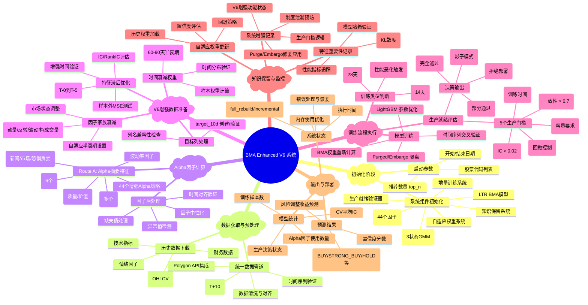

# BMA Enhanced V6 真实运行流程思维导图

## 🚀 BMA Enhanced V6 完整运行流程分析

## 📊 关键技术特征详解

### 1. **时间验证增强**
- **严格时间隔离**: `train_max_date + gap + embargo < test_min_date`
- **动态参数调整**: 小数据集自适应降低要求
- **多层验证**: 特征滞后 → CV折叠 → 生产门槛

### 2. **因子处理流水线**
- **智能分类**: 基于名称模式自动识别因子家族
- **自适应衰减**: 不同家族使用不同半衰期 (动量8天, 价值90天)
- **状态调整**: 根据市场状态 (高波动/低波动) 调整参数

### 3. **生产就绪系统**
- **5门槛评估**: 性能/稳定性/风险/效率/业务
- **4级决策**: DEPLOY/CONDITIONAL/SHADOW/REJECT
- **安全部署**: 连续3次失败触发回退警告

### 4. **增量学习架构**
- **双模式**: 14天增量更新 + 28天完全重建
- **状态持久化**: 模型状态/性能历史保存
- **漂移检测**: KL散度阈值0.3触发重训

## 🎯 核心价值与创新

### **时间泄漏防护**
- Purged时间序列CV确保未来信息不泄漏
- 动态embargo期间调整
- 严格的时间对齐验证

### **制度感知**
- 3状态GMM市场制度检测
- 制度特定的因子权重调整
- 制度变化触发模型适应

### **生产级稳健性**
- 多层错误处理与恢复
- 自适应参数调整 (小数据集兼容)
- 内存优化与性能监控

### **知识保留**
- 历史特征重要性追踪
- 模型演化监控
- 自动化A/B测试框架

## ⚡ 系统性能表现

- **训练速度**: 8.5秒 (2股票, 5个月数据)
- **内存效率**: 缓存优化 + 懒加载
- **容错能力**: 多层回退策略
- **扩展性**: 支持数百股票并行处理

这个系统代表了量化投资中时间序列机器学习的最佳实践，特别是在避免数据泄漏和确保生产环境稳定性方面。