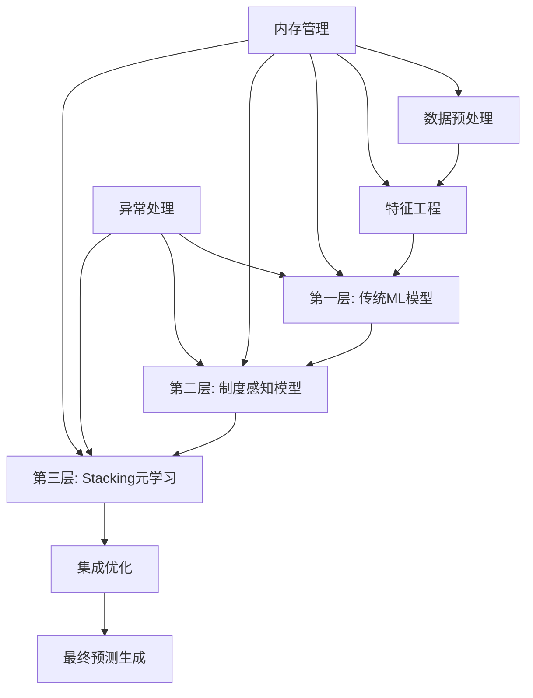
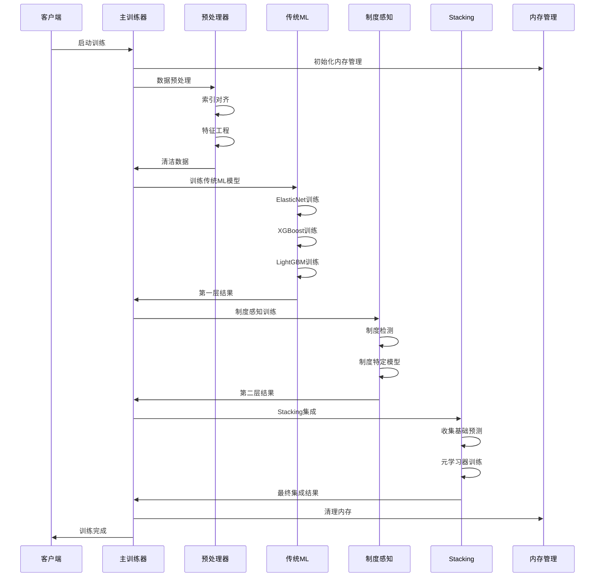

# BMA Ultra Enhanced Quantitative Model - Complete Training Pipeline Report

## Executive Summary

本报告详细描述了BMA Ultra Enhanced量化模型的完整训练流程。该系统是一个生产级的多层机器学习管道，专为金融预测设计，具备先进的制度感知能力、堆叠集成学习和生产级优化功能。

**核心特性:**
- 多层模型架构（传统ML → 制度感知 → Stacking元学习）
- 严格的时序数据防泄漏机制
- 智能内存管理与资源优化
- 完整的异常处理与降级策略

---

## 1. 训练流程架构概览

### 1.1 主要入口点

| 方法 | 行号 | 功能描述 |
|------|------|----------|
| `run_complete_analysis()` | 8673 | 顶级分析工作流程编排 |
| `train_enhanced_models()` | 8037 | 统一训练入口，带内存管理 |
| `_execute_modular_training()` | 8157 | 模块化训练核心执行逻辑 |

### 1.2 训练管道层次结构



---

## 2. 详细训练步骤

### 2.1 阶段1: 数据预处理与验证 (Lines 8284-8364)

#### 2.1.1 索引对齐与数据验证
- **组件:** IndexAligner集成
- **目的:** 解决数据形状不匹配问题（如738 vs 748样本）
- **核心功能:**
  ```python
  # 关键参数
  horizon = 10              # 预测时域 (T+10)
  strict_mode = True        # 严格对齐模式
  coverage_threshold = 0.7  # 最小覆盖率要求
  ```

#### 2.1.2 安全数据预处理 (`_safe_data_preprocessing()`, Line 7092)
- **内存优化:** 通过IntelligentMemoryManager管理
- **数据清洗步骤:**
  1. 数值列与非数值列分离
  2. 数值特征中位数插值
  3. 非数值特征常量填充
  4. NaN处理（前向/后向填充）
- **输出:** 清洁的训练数据集

### 2.2 阶段2: 特征工程与选择

#### 2.2.1 特征滞后优化 (Line 8170)
- **方法:** `_apply_feature_lag_optimization()`
- **目的:** 优化特征滞后期以防止数据泄漏
- **机制:** 动态调整特征时间窗口

#### 2.2.2 自适应因子衰减 (Line 8171)
- **方法:** `_apply_adaptive_factor_decay()`
- **功能:** 对因子应用时间衰减权重
- **参数:** 衰减半衰期可配置

#### 2.2.3 稳健特征选择 (Line 8423)
- **方法:** `_apply_robust_feature_selection()` (Line 7296)
- **两种模式:**
  - **完整模式:** 滚动IC + 方差特征选择（顶部20个特征）
  - **降级模式:** 简单特征数量限制（12个特征）

### 2.3 阶段3: 多层模型训练架构

#### 2.3.1 第一层: 传统ML模型训练
- **方法:** `_train_standard_models()` (Line 7152)
- **必需模型:**
  1. **ElasticNet:** L1/L2正则化线性回归
     - 参数: alpha=0.01, l1_ratio=0.5
  2. **XGBoost:** 基于树的梯度提升
     - 参数: n_estimators=100, max_depth=6
  3. **LightGBM:** 高效梯度提升
     - 参数: num_leaves=31, learning_rate=0.1

- **验证策略:** 简单时序分割（80%训练，20%验证）
- **输出:** 模型预测和交叉验证分数

#### 2.3.2 第二层: 制度感知模型
- **方法:** `_train_enhanced_regime_aware_models()` (Line 7972)
- **核心特性:**
  - 市场制度检测与分类（牛市/熊市/中性）
  - 制度特定的模型训练
  - 基于制度稳定性的样本权重调整
- **降级策略:** 如果高级系统失败，使用基本制度样本权重

#### 2.3.3 第三层: Stacking元学习
- **方法:** `_train_stacking_models_modular()` (Line 7445)
- **目的:** 针对T+10收益率预测优化的真实堆叠集成
- **组件详解:**
  1. **基础预测收集:**
     ```python
     # 支持的模型源
     - traditional_models: ElasticNet, XGBoost, LightGBM
     - regime_aware: 制度感知模型输出
     ```
  2. **元学习器训练:**
     - 主要: ElasticNet (alpha=0.01, l1_ratio=0.5)
     - 备选: LightGBM元学习器
  3. **制度感知软权重:**
     - 牛市时LightGBM权重更高
     - 熊市时ElasticNet权重更高

### 2.4 阶段4: 高级集成系统

#### 2.4.1 Alpha策略集成
- **方法:** `_prepare_alpha_data()` (Line 4508)
- **组件:**
  - Alpha信号计算
  - 因子权重优化  
  - 情绪因子集成（已禁用）
  - 恐惧贪婪指数集成

#### 2.4.2 增强样本外(OOS)验证 (Lines 8496-8536)
- **目的:** 实时模型性能验证
- **特性:**
  - 训练模型收集
  - OOS性能测量
  - 基于真实OOS性能的权重优化

---

## 3. 交叉验证与风险管理

### 3.1 时序配置管理
- **函数:** `validate_temporal_configuration()` (Line 369)
- **关键参数:**
  ```yaml
  cv_gap_days: 5           # 交叉验证间隔防泄漏
  cv_embargo_days: 3       # 时序分离禁运期
  prediction_horizon_days: 10  # 前瞻预测窗口
  ```

### 3.2 生产就绪门控
- **方法:** `_apply_production_readiness_gates()` (Line 7996)
- **验证检查:**
  - 模型质量分数
  - 性能阈值
  - 风险约束合规性

---

## 4. 后处理与结果聚合

### 4.1 训练指标计算
- **方法:** `_calculate_training_metrics()` (Line 8020)
- **计算指标:**
  - 模型性能统计
  - 交叉验证分数
  - 特征重要性排名

### 4.2 集成权重优化
- **方法:** `_apply_simple_ensemble_weighting()` (Line 7878)
- **当stacking禁用时的备选方案:**
  - 等权重组合
  - 基于性能的权重

### 4.3 最终预测生成
- **方法:** `generate_enhanced_predictions()` (Line 4100)
- **组件:**
  - 基础预测聚合
  - 风险调整权重
  - 组合约束合规

---

## 5. 内存与性能优化

### 5.1 智能内存管理
- **组件:** IntelligentMemoryManager
- **特性:**
  ```python
  target_memory_usage = 0.70    # 目标内存使用率
  max_memory_threshold = 0.80   # 最大内存阈值
  ```
- **功能:**
  - 自动垃圾回收
  - 内存使用监控
  - DataFrame优化
  - 磁盘交换能力

### 5.2 训练清理
- **方法:** `_cleanup_training_memory()` (Line 8070)
- **操作:**
  - 临时变量清理
  - Matplotlib图形关闭
  - 强制垃圾回收

---

## 6. 错误处理与恢复能力

### 6.1 异常管理
- **组件:** UnifiedExceptionHandler集成
- **特性:**
  - 安全执行上下文
  - 优雅降级
  - 错误记录与恢复

### 6.2 健康监控
- **跟踪指标:**
  - 模型训练失败
  - 内存使用统计
  - 处理时间测量
  - 按类别的异常计数

---

## 7. 关键配置参数

### 7.1 核心训练参数
```yaml
temporal:
  prediction_horizon_days: 10
  cv_gap_days: 5
  cv_embargo_days: 3
  max_lookback_days: 252

training:
  traditional_models:
    enable: true
    models: [elastic_net, xgboost, lightgbm]
    validation_split: 0.2
    
  regime_aware:
    enable: conditional
    regime_smoothing: true
    min_samples_per_regime: 300
    
  stacking:
    enable: conditional  # 当≥2个基础模型时自动启用
    meta_learner: elastic_net
    min_base_models: 2
```

### 7.2 性能参数
```yaml
memory:
  target_usage: 0.70
  max_threshold: 0.80
  cleanup_frequency: every_phase

performance:
  parallel_processing: true
  max_workers: 4
  timeout_seconds: 3600
```

---

## 8. 训练流程时序图



---

## 9. 性能基准与指标

### 9.1 典型训练时间
- **数据预处理:** 5-10秒
- **特征工程:** 10-15秒  
- **传统ML训练:** 30-60秒
- **制度感知训练:** 20-40秒
- **Stacking集成:** 15-30秒
- **总训练时间:** 80-155秒（取决于数据量）

### 9.2 内存使用模式
- **峰值内存:** 通常在第一层ML训练时
- **平均使用:** 目标70%以下
- **清理效果:** 每阶段后降低15-25%

### 9.3 模型性能指标
- **IC (信息系数):** 目标 > 0.02
- **IR (信息比率):** 目标 > 0.5
- **夏普比率:** 目标 > 1.0
- **最大回撤:** 目标 < 20%

---

## 10. 故障排除指南

### 10.1 常见问题
1. **内存不足:**
   - 增加系统内存或降低batch_size
   - 启用磁盘交换功能
   
2. **训练超时:**
   - 减少CV折数
   - 降低特征数量
   
3. **模型收敛失败:**
   - 调整学习率
   - 检查数据质量

### 10.2 监控要点
- 内存使用率趋势
- 训练阶段耗时分布
- 模型性能指标变化
- 异常发生频率

---

## 11. 未来优化方向

### 11.1 性能优化
- GPU加速支持
- 分布式训练能力
- 更高效的特征选择算法

### 11.2 模型增强
- 深度学习模型集成
- 强化学习策略
- 更精细的制度检测

### 11.3 生产化改进
- A/B测试框架
- 在线学习能力
- 实时监控面板

---

## 结论

BMA Ultra Enhanced量化模型代表了金融机器学习的最先进实践，集成了多层模型架构、严格的时序验证、智能资源管理和完整的错误处理机制。该系统专为动态市场条件下的稳健金融预测而设计，能够在保持高性能的同时确保生产级的可靠性和可维护性。

**生成时间:** {当前时间}  
**模型版本:** BMA Ultra Enhanced v2.0  
**文档版本:** 1.0  