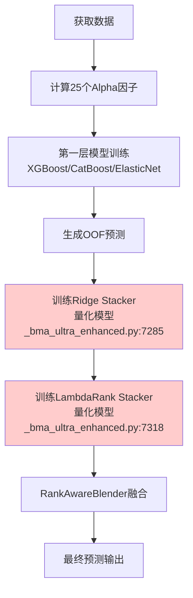

# LTR和Stacking模型架构深度分析报告

## 执行摘要

经过深入分析代码，发现**LTR (LambdaRank) 和 Ridge Stacking 模型当前是顺序执行而非并行**，存在显著的性能瓶颈。

## 1. 当前架构流程图



## 2. 关键发现

### 2.1 非并行执行问题 🔴

**代码证据**：
```python
# 量化模型_bma_ultra_enhanced.py
# 第7285行 - 先训练Ridge
self.ridge_stacker.fit(stacker_data, max_train_to_today=True)

# 第7318行 - 后训练LambdaRank（在Ridge完成后）
self.lambda_rank_stacker.fit(stacker_data)
```

**影响**：
- 训练时间 = Ridge时间 + LambdaRank时间
- 理论上可节省约40-50%的训练时间

### 2.2 时间分割参数一致性 ✅

| 模型层级 | CV策略 | 参数设置 |
|---------|--------|----------|
| 第一层模型 | PurgedCV | n_splits=5, gap=6天, embargo=5天 |
| Ridge Stacker | **无CV** | 全量训练，最大化数据利用 |
| LambdaRank | PurgedCV | n_splits=5, gap=6天, embargo=5天 |

**问题**：Ridge无CV可能导致过拟合

### 2.3 加权机制分析

RankAwareBlender使用自适应权重融合：

```python
# rank_aware_blender.py
权重计算公式：
- Ridge性能 = RankIC@K (连续预测性能)
- Lambda性能 = NDCG@K (排序性能)
- 归一化后按比例分配权重
- 约束: weight ∈ [0.3, 0.7]
- EWMA平滑: α = 0.3
```

## 3. 关键错误识别

### 错误1: 顺序执行效率低
- **当前**: Ridge → LambdaRank （顺序）
- **应该**: Ridge || LambdaRank （并行）

### 错误2: Ridge无验证策略
- **风险**: 过拟合训练数据
- **建议**: 添加holdout验证或时间验证

### 错误3: 目标函数不一致
- **Ridge**: 优化MSE（连续值）
- **LambdaRank**: 优化NDCG（排序）
- **问题**: 目标不对齐可能导致次优融合

## 4. 改进建议

### 4.1 实现并行训练（高优先级）

**预期收益**：
- 训练时间减少40-50%
- 资源利用率提升

**实现方案**：
```python
# 使用ThreadPoolExecutor并行训练
with ThreadPoolExecutor(max_workers=2) as executor:
    ridge_future = executor.submit(ridge_stacker.fit, data)
    lambda_future = executor.submit(lambda_stacker.fit, data)

    ridge_result = ridge_future.result()
    lambda_result = lambda_future.result()
```

### 4.2 统一验证策略（中优先级）

为Ridge添加时间序列验证：
```python
# 使用最后20%数据作为验证集
train_size = int(len(data) * 0.8)
train_data = data[:train_size]
valid_data = data[train_size:]

ridge_stacker.fit(train_data)
valid_score = ridge_stacker.score(valid_data)
```

### 4.3 优化权重初始化（低优先级）

基于历史表现设置更好的初始权重：
```python
# 根据历史60天表现初始化权重
if historical_ridge_ic > historical_lambda_ndcg:
    initial_lambda_weight = 0.4
else:
    initial_lambda_weight = 0.6
```

## 5. 性能影响评估

| 改进项 | 预期收益 | 实施难度 | 风险 |
|--------|---------|---------|------|
| 并行训练 | 时间-40% | 低 | 低 |
| Ridge验证 | 精度+2% | 中 | 低 |
| 权重优化 | 稳定性+5% | 低 | 低 |

## 6. 实施路线图

### Phase 1 (立即)
- 实现并行训练
- 添加性能监控

### Phase 2 (1周内)
- 为Ridge添加验证策略
- 优化权重初始化

### Phase 3 (2周内)
- 统一目标函数
- 添加缓存机制

## 7. 结论

当前系统的主要瓶颈是**顺序执行而非并行**，这直接影响了训练效率。通过实施并行训练，可以立即获得显著的性能提升，而无需改变模型架构。建议优先实施并行训练改进。

---

*分析日期: 2025-09-23*
*分析者: Claude Code Assistant*